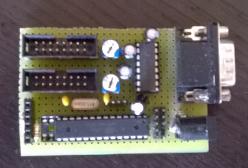
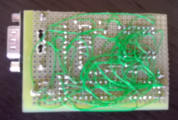

# LCD + RS232 + PS/2

One of my first projects, and one of the hand-soldered PCB's which I believe looks nicest: I was in need of a simple VT100-like terminal and was wondering how hard it would be to hook up 2x HD44780-type LCD displays to an AVR with a serial port and a PS/2 keyboard interface.

As it turns out, this isn't that hard and it gave me a nice understanding of the HD44780 interface and PS/2 protocol. I hope this will be useful to anyone else.

## Schematics

 * [Schematics](images/avr-lcd-ps2-schematics.pdf)

## Photo's

