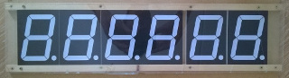
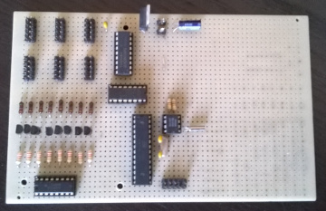
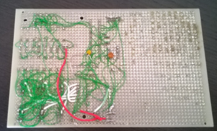

# large clock

I like being on time, and I was wondering how hard it would be to create a digital clock. One of the goals was that it should be pretty large, so I could read it from across the room. Once I noticed the nice 4&quot; Hi-Red 7-Segment LED display parts at Futurlec, a project was born!

Unfortunately, the hardware broke during various movements (and as you can see, especially the display connectors are a mess) - perhaps I will do a redesign at some point in time, using my new PCB layout skills to avoid the green-wired-mess. Until then, I've brought the clock to the electronics recycling facility.

## Schematics

 * [Schematics](images/large-clock-schematics.pdf)

## Photos

