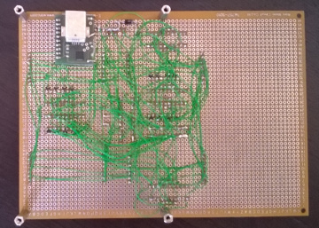

# 16x16 LED matrix

Once I started looking into things like 74HCT595 shift registers, I thought it would be nice to create my own LED matrix. My initial prototype consists of hand-soldering 8x8 LEDs, which worked but I quickly got quite fed up with it (as it was a total mess)

As for version 2.0, I decided just to buy four 8x8 red LED matrix parts at Futurlec and place them on a PCB (note that the pinout of the LED matrix parts is a bit weird). I used 4x TPIC6B595 shift registers along with 8x BC-857 PNP transisters to handle power - the shift registers are all hooked to each other, so the AVR can just clock 32 bits in a single go.

## Schematics

 * [Schematics](images/led-matrix-schematics.pdf)

## Photos

